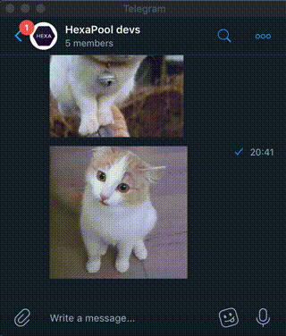
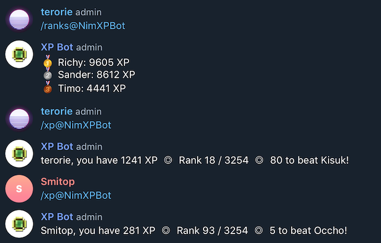

# Telegram XP bot

### Blocks pictures + videos from low XP users

### Keeps track of group statistics

Configuration:
 - `$REDIS_URL` Redis host:port (optional)
 - `$REDIS_PREFIX` Redis ZSET key prefix (one key per group)
 - `$TELEGRAM_TOKEN` BotFather token
 - `$MIN_XP` Minimum XP before pics/vids allowed
 - `$RATE_LIMIT` User cooldown after earning XP (seconds)
 - `$LESS_BOT_SPAM` Delete /xp and /rank requests + responses after a while to reduce group chat clutter
 - `$BOT_EXPIRATION` Time to delete bot messages from the group (requires option above)

Commands:
 - `/xp` Get current XP
 - `/ranks` Get top XP users

Redis keys:
 - `${REDIS_PREFIX}_${GROUP_ID}` Leaderboard
 - `${REDIS_PREFIX}_${GROUP_ID}_DELETED_COUNT` Number of messages deleted
